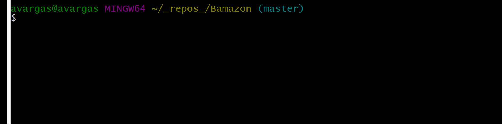
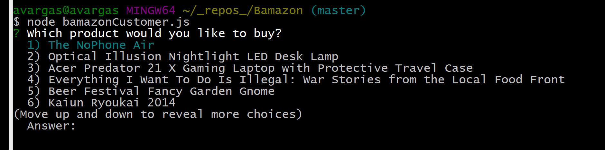
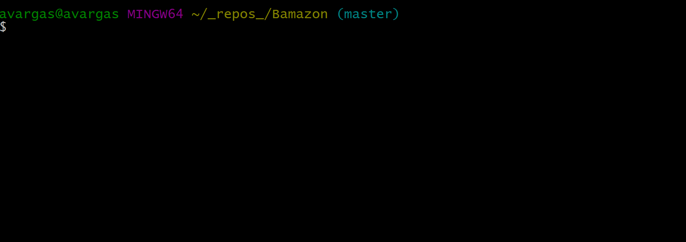
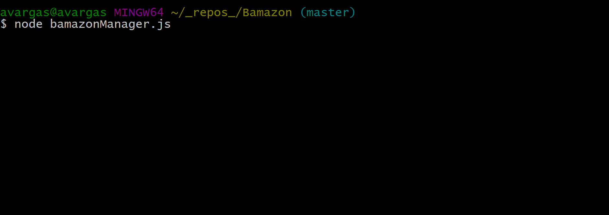
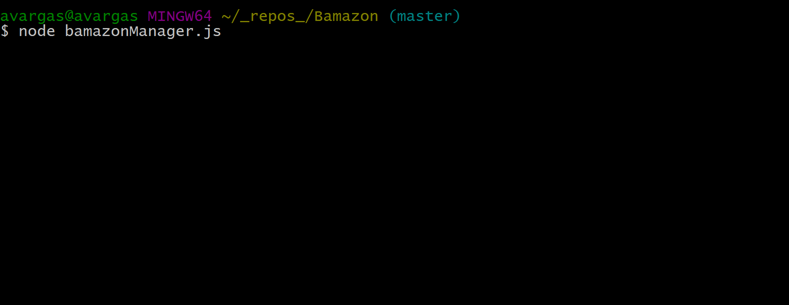
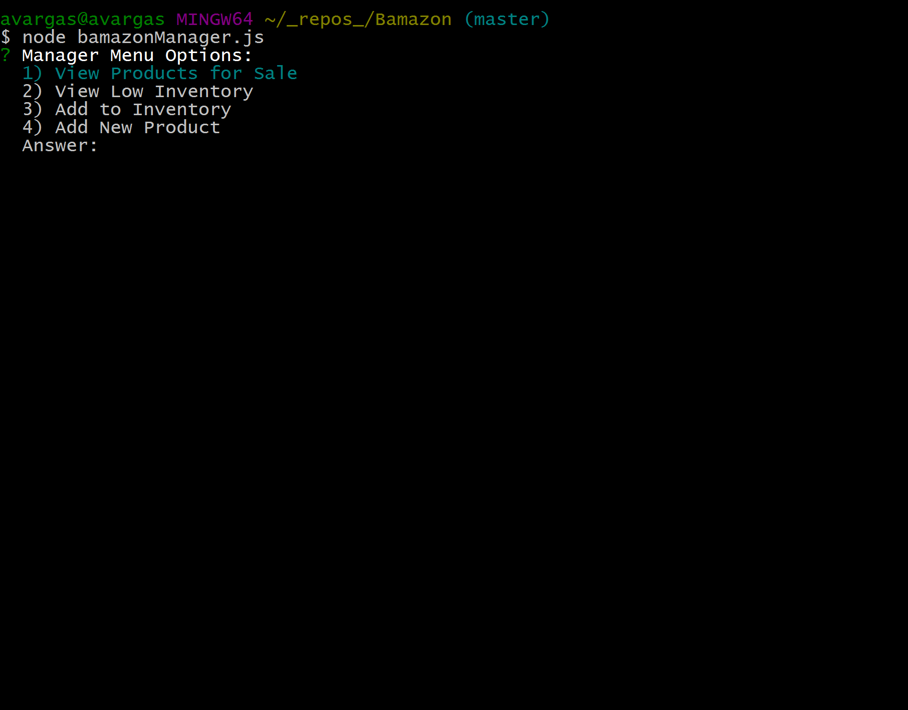
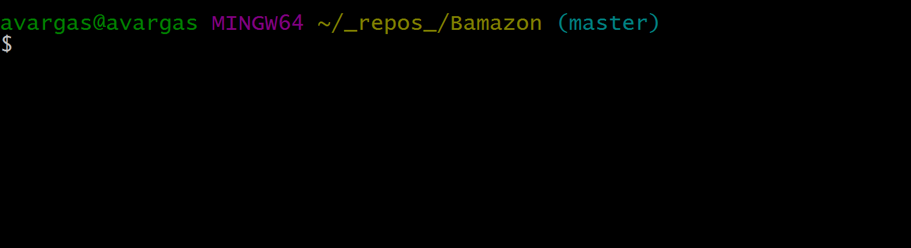
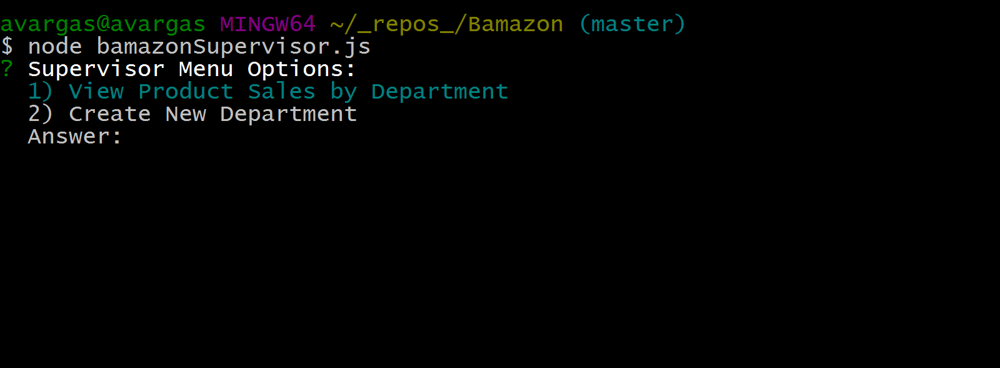
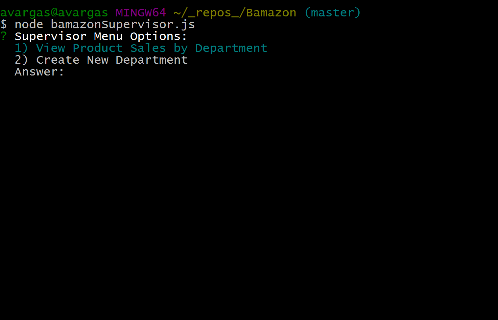

# Bamazon

## Intro

Bamazon is an Amazon-like storefront. Bamazon takes orders from customers and depletes stock from the store's inventory. It can also track product sales across store's departments and provide a summary of the highest-grossing departments in the store.

## Table of Contents

* [How it works](#how-it-works)
  * [Bamazon Views](#bamazon-views)
    * [Customer View](#customer-view)
        * [Choosing items to buy](#choosing-items-to-buy)
        * [Choosing quantity to buy](#choosing-quantity-to-buy)
    * [Manager View](#manager-view)
        * [Viewing products for sale](#viewing-products-for-sale)
        * [Adding items to inventory](#adding-items-to-inventory)
        * [Adding new products](#adding-new-products)
    * [Supervisor View](#supervisor-view)
        * [Viewing product sales by department categories](#viewing-product-sales-by-department-categories)
        * [Creating new departments](#creating-new-departments)

  ## How it works

  ### Bamazon views

  Bamazon has three views:

  * Customer View
  * Manager View
  * Supervisor View

  These are all separate node applications that communicate to a central SQL database with the help of the MySQL and Inquirer npm packages.

  #### Customer View

  
  #### Choosing items to buy
  Running this application on your terminal or Git Bash if you're a Mac or Windows user, respectively, will first prompt you to choose among all of the items for sale.

  

  #### Choosing quantity to buy
  
  You will then be prompted for the quantity to buy for the chosen product. Once you choose how much you want to buy, this app checks if there is enough of the product in the inventory. If so, then you will get a total cost for the purchase, and the inventory is updated so as to reflect any previous transactions.

  

  If the quantity entered is greater than the stock in the inventory, then you won't be able to place an order!

  

  ### Manager View

  Running this node application will present you with a list of menu options:

  1. `View Products for Sale`
  2. `View Low Inventory`
  3. `Add to Inventory`
  4. `Add New Product`

  #### Viewing products for sale

  `View Products for Sale` lists every available item: the item IDs, names, item department, prices, stock quantities, and sales per product.

  

  #### Viewing products with low inventory

  `View Low Inventory` lists all items with an inventory count lower than five.

  

  #### Adding items to inventory

  `Add to Inventory` prompts the manager to choose a store item to "add more" to. It follows by giving managers an updated table for the product added to.

  

  #### Adding new products

  `Add New Product` allows the manager to add a completely new product to the store.

  

  ### Supervisor View

  Running this app will list the following menu options:

  1. `View Product Sales by Department`
  2. `Create New Department`

  

  #### Viewing product sales by department categories
  
  `View Product Sales by Department` displays a summarized table in your termina/bash window with the department id, department name, overhead costs, product sales, and total profit for each of the department categories of the storefront.

  
  
  #### Creating new departments
  
  `Create New Department` allows supervisors to add a new department of their liking. It then displays a new updated table of current department ids, names, and overhead costs.

  

  [Top](#intro)

